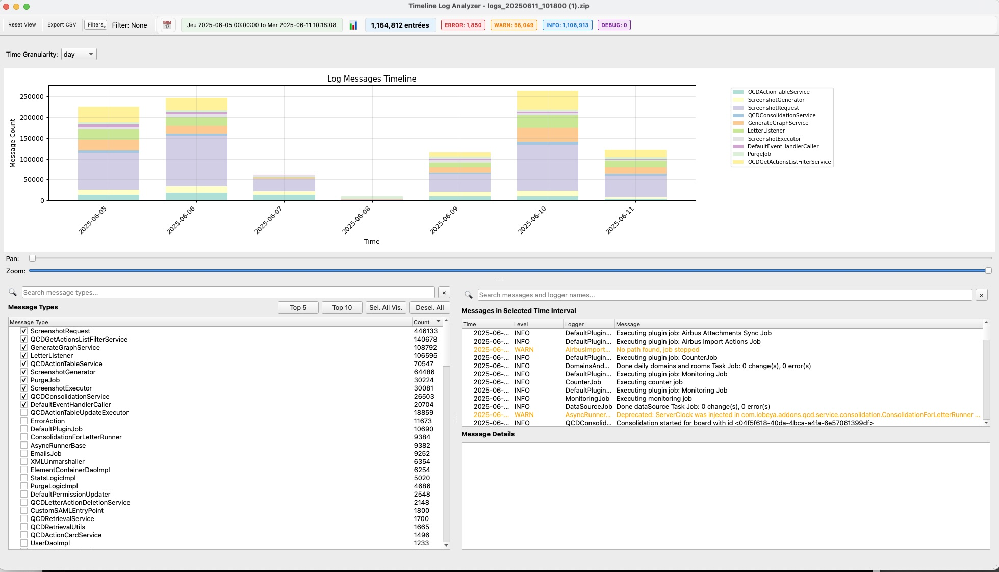
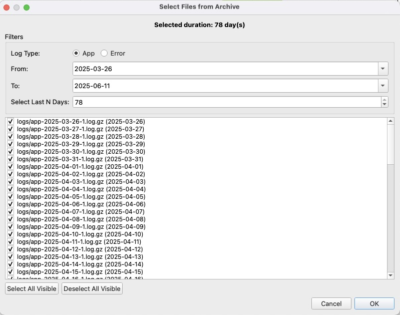
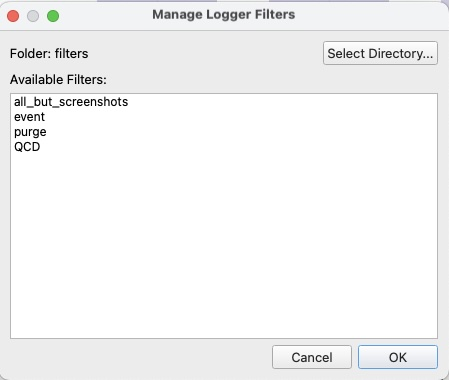
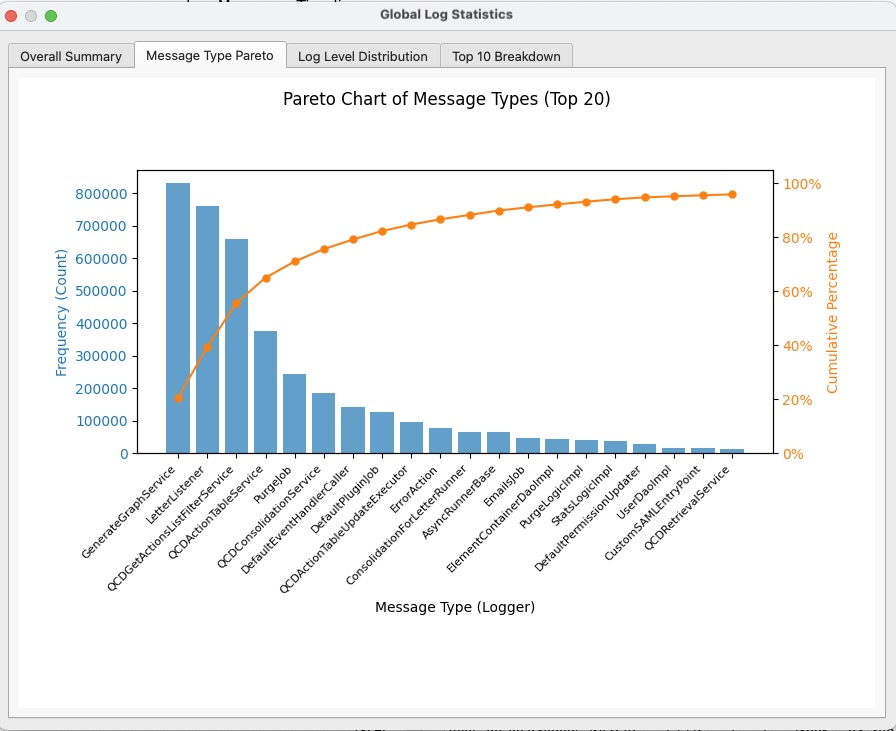

# iObeya Log Analyzer

A powerful desktop application for analyzing and visualizing iObeya log files, designed to handle large single logs and multi-file archives with ease.

**For a full, interactive documentation, please [view the HTML version here](./docs/index.html).**

 
## Overview

This tool provides an interactive timeline-based interface to help developers and support engineers navigate through thousands of log entries efficiently. It allows for rapid filtering by time, log level, and message type (logger), and supports loading compressed `.log.gz` files and `.zip` archives. Its primary goal is to turn complex log analysis from a chore into a fast and intuitive process.

## Key Features

-   **Interactive Timeline**: Visualize log entry distribution over time. Click and drag to instantly filter by a specific time range.
-   **Multi-Level Filtering**: Combine filters for log level, time range, message type, and free-text search to quickly isolate events.
-   **Advanced Archive Loading**: A dedicated dialog provides precise control for loading files from `.zip` archives, allowing selection by filename patterns and date ranges.
-   **Gzip & Encoding Support**: Automatically decompresses `.log.gz` files and handles multiple text encodings (`UTF-8`, `latin-1`, etc.).
-   **Detailed View**: A dedicated panel shows the full, multi-line content of any selected log entry, including full stack traces.
-   **Rich Statistics**: An integrated dialog displays a breakdown of log levels and a Pareto chart of the most frequent message types, helping to identify the most common issues at a glance.
-   **Filter Management**: Save a complex set of message type filters to a file and re-apply it later, perfect for investigating recurring problems.
-   **Data Export**: Export the currently filtered log data to a CSV file for reporting or further analysis.
-   **Welcome Screen**: A helpful startup dialog provides quick access to recent files and actions to load new logs, streamlining the initial workflow.
-   **Application Icon**: Features a custom application icon for better desktop integration.
-   **Message Navigation**: Quickly navigate between log entries of the same type directly from the details panel using "Next" and "Previous" buttons.
-   **Full-Text Indexing**: Optionally enable full-text indexing during archive loading to enhance search capabilities within the logs.

## What's New in Version 7.0

- **Smart Initial View**: To accelerate initial analysis, the application now automatically selects the top 10 most frequent message types when a log file is first loaded. This provides an immediate, focused view on the most active loggers.
- **Full-Text Indexing Checkbox**: Added a checkbox in the archive selection dialog to enable or disable full-text indexing during the loading process.

## Gallery

### Main Application View
Example view of the main application window with the smart initial view feature enabled.


### Advanced Archive Loading


### Filter Management


### Statistics Dialog


### Welcome Screen


## Installation

### Prerequisites

-   Python 3.6+
-   An environment manager like `venv` or `conda` is recommended.

### Steps

1.  **Clone the repository:**
    ```bash
    git clone https://github.com/jreveliobeya/iObeya-Logs-Analyzer.git
    cd iObeya-Logs-Analyzer
    ```

2.  **Create and activate a virtual environment (recommended):**
    ```bash
    python -m venv venv
    source venv/bin/activate  # On Windows, use `venv\Scripts\activate`
    ```

3.  **Install the required packages:**
    ```bash
    pip install -r requirements.txt
    ```

## Usage

To run the application, execute the main script from the project's root directory:

```bash
python iobeya_log_analyzer.py
```

### Loading Logs

-   **Load Single File**: Use `File > Load Log File` to open a single `.log` or `.log.gz` file.
-   **Load Archive**: Use `File > Load Log Archive` to open a `.zip` archive. This opens the **Archive Selection Dialog**, where you can filter files by name (e.g., `app`, `error`) and date range before loading.

### The Interface

-   **Timeline (Top)**: Shows log volume over time. Click and drag to select a time range. Use the granularity dropdown (Minute, Hour, Day) and the pan/zoom sliders to navigate.
-   **Filters & Message Types (Left)**: Contains controls for filtering.
    -   **Log Levels**: Toggle `INFO`, `WARN`, `ERROR`, `DEBUG` from the toolbar.
    -   **Message Types**: Search, select, or deselect specific logger names. Use `Top 5`/`Top 10` to quickly focus on the most frequent loggers.
-   **Log Entries (Right)**: Displays the filtered log entries. The search bar provides free-text filtering. Click an entry to see its full content in the panel below.

### Advanced Workflows

-   **Understanding Multi-Line Entries**: The application intelligently groups multi-line messages, such as stack traces, with their parent log entry. This ensures that a complete error report is treated as a single event.

    *Example:*
    A Java stack trace following an error message will be displayed as one entry:
    ```
    2024-05-20 14:35:02 ERROR [com.iobeya.service.Database] Failed to execute query: Connection timed out.
      at com.iobeya.service.Database.executeQuery(Database.java:101)
      at com.iobeya.service.RoomService.loadData(RoomService.java:50)
    ```

## Changelog

### v7.0
- **Feature**: Implemented a powerful, indexed full-text search engine for fast querying of all log messages.
- **Feature**: Added a "Smart Initial View" that automatically selects the top 10 most frequent message types on first load to accelerate analysis.
- **Enhancement**: Updated application version to 7.0.

## Expected Log Format

The parser expects log entries to follow this structure:

```
YYYY-MM-DD HH:MM:SS LEVEL [logger_name] Message content
```

**Example:**

```
2024-05-20 14:35:01 INFO [com.iobeya.service.RoomService] User 'admin' entered room '123'
2024-05-20 14:35:02 ERROR [com.iobeya.service.Database] Failed to execute query: Connection timed out.
  at com.iobeya.service.Database.executeQuery(Database.java:101)
  at com.iobeya.service.RoomService.loadData(RoomService.java:50)
```

## Changelog

### v6.0 (Current)
- **Cancellable Loading**: Implemented the ability to cancel an ongoing loading process, with an option to keep already loaded data.
- **UI and Logic Overhaul**: Switched to a centralized `AppLogic` architecture for better maintainability.
- **Performance Improvements**: Integrated `VirtualTreeWidget` for near-instant display of thousands of message types.
- **Persistent Filters**: Added a system for managing and saving filter sets.
- **Improved Stability**:
    - Resolved a `ValueError` crash in the statistics panel.
    - Fixed a `NameError` that prevented the Pareto chart from rendering.
- **Enhanced Navigation**: Added "Previous" and "Next" buttons to quickly navigate between messages of the same type.

## Roadmap

### Priority 1: Core Functionality & Bugs
-   **Fix Timeline Reset Bug**: Prevent the timeline date range from resetting after loading a new archive.
-   **Verify Full-Text Search**: Thoroughly test and stabilize the free-text search functionality across all log entries.
-   **Improve Timeline Navigation**: Overhaul the UI for zooming and panning on the timeline to make it more intuitive and responsive.
-   **Dynamic Y-Axis Zoom**: Add an option to automatically rescale the timeline's Y-axis based on the visible data when zoomed or panned.

### Priority 2: Feature Enhancements
-   **Pre-Load Filters**: Integrate the filter management system into the archive selection dialog, allowing users to apply a filter *before* loading data.
-   **"View in Original File"**: Add a feature to open the original log file and navigate directly to the line corresponding to a selected log entry.
-   **In-View Severity Filtering**: Allow users to apply temporary severity filters to the currently displayed list of messages without reloading.
-   **Memory Management**: Introduce a feature to manually unload/delete specific message types from memory to improve performance with extremely large datasets.

### Priority 3: UI/UX & Quality of Life
-   **Dark Mode**: Implement a full dark theme for the application.
-   **Default Timeline Range**: Allow setting a default time window using the calendar icon in the toolbar.

### Priority 4: Advanced Functionality
-   **Advanced Search with Regex**: Enhance the search functionality to support regular expressions, value extraction (e.g., capturing numbers), and conditional highlighting based on predefined thresholds.
