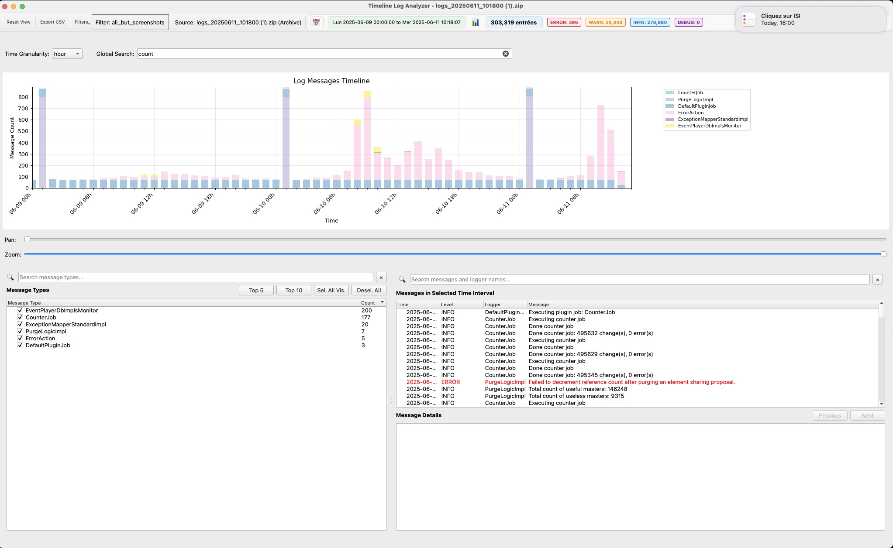

# iObeya Log Analyzer

A powerful desktop application for analyzing and visualizing iObeya log files, designed to handle large single logs and multi-file archives with ease.

## Overview

This tool provides an interactive timeline-based interface to help developers and support engineers navigate through thousands of log entries efficiently. It allows for rapid filtering by time, log level, and message type (logger), and supports loading compressed `.log.gz` files and `.zip` archives. Its primary goal is to turn complex log analysis from a chore into a fast and intuitive process.

## Key Features

-   **Interactive Timeline**: Visualize log entry distribution over time. Click and drag to instantly filter by a specific time range.
-   **Multi-Level Filtering**: Combine filters for log level, time range, message type, and free-text search to quickly isolate events.
-   **Advanced Archive Loading**: A dedicated dialog provides precise control for loading files from `.zip` archives, allowing selection by filename patterns and date ranges.
-   **Gzip & Encoding Support**: Automatically decompresses `.log.gz` files and handles multiple text encodings (`UTF-8`, `latin-1`, etc.).
-   **Detailed View**: A dedicated panel shows the full, multi-line content of any selected log entry, including full stack traces.
-   **Rich Statistics**: An integrated dialog displays a breakdown of log levels and a Pareto chart of the most frequent message types, helping to identify the most common issues at a glance.
-   **Filter Management**: Save a complex set of message type filters to a file and re-apply it later, perfect for investigating recurring problems.
-   **Data Export**: Export the currently filtered log data to a CSV file for reporting or further analysis.

## Gallery

### Main Application View


### Advanced Archive Loading


### Filter Management


### Statistics Dialog


## Installation

### Prerequisites

-   Python 3.6+
-   An environment manager like `venv` or `conda` is recommended.

### Steps

1.  **Clone the repository:**
    ```bash
    git clone https://github.com/jreveliobeya/iObeya-Logs-Analyzer.git
    cd iObeya-Logs-Analyzer
    ```

2.  **Create and activate a virtual environment (recommended):**
    ```bash
    python -m venv venv
    source venv/bin/activate  # On Windows, use `venv\Scripts\activate`
    ```

3.  **Install the required packages:**
    ```bash
    pip install -r requirements.txt
    ```

## Usage

To run the application, execute the main script from the project's root directory:

```bash
python iobeya_log_analyzer.py
```

### Loading Logs

-   **Load Single File**: Use `File > Load Log File` to open a single `.log` or `.log.gz` file.
-   **Load Archive**: Use `File > Load Log Archive` to open a `.zip` archive. This opens the **Archive Selection Dialog**, where you can filter files by name (e.g., `app`, `error`) and date range before loading.

### The Interface

-   **Timeline (Top)**: Shows log volume over time. Click and drag to select a time range. Use the granularity dropdown (Minute, Hour, Day) and the pan/zoom sliders to navigate.
-   **Filters & Message Types (Left)**: Contains controls for filtering.
    -   **Log Levels**: Toggle `INFO`, `WARN`, `ERROR`, `DEBUG` from the toolbar.
    -   **Message Types**: Search, select, or deselect specific logger names. Use `Top 5`/`Top 10` to quickly focus on the most frequent loggers.
-   **Log Entries (Right)**: Displays the filtered log entries. The search bar provides free-text filtering. Click an entry to see its full content in the panel below.

### Advanced Workflows

-   **Investigating an Incident**: Start by loading the relevant archive and selecting the approximate date range. Use the timeline to narrow down the period of high activity. Then, use the message type and log level filters to isolate error messages and their context.
-   **Managing Recurring Errors**: When you've identified the set of logger names related to a specific problem, use `Tools > Manage Filters > Save Current Selection` to save it. The next time the issue occurs, you can use `Apply Filter` to instantly apply this view to a new set of logs.
-   **Performance Analysis**: Use the `Tools > Show Statistics` dialog to identify the noisiest components in your system. A high frequency of certain logs could indicate performance bottlenecks or misconfigurations.

## Expected Log Format

The parser expects log entries to follow this structure:

```
YYYY-MM-DD HH:MM:SS LEVEL [logger_name] Message content
```

**Example:**

```
2024-05-20 14:35:01 INFO [com.iobeya.service.RoomService] User 'admin' entered room '123'
2024-05-20 14:35:02 ERROR [com.iobeya.service.Database] Failed to execute query: Connection timed out.
  at com.iobeya.service.Database.executeQuery(Database.java:101)
  at com.iobeya.service.RoomService.loadData(RoomService.java:50)
```

-   Multi-line content (like stack traces) is automatically appended to the preceding entry.

## Recent Updates

-   **Log View Enhancements**:
    -   **Line Colorization**: Log lines in the detailed view are now colored based on their severity level (Red for ERROR, Orange for WARN) for quicker identification.

-   **Timeline Improvements**:
    -   **Weekly Granularity**: The timeline can now be viewed with a "week" granularity, providing a broader overview of log activity.
    -   **Enhanced Tooltips**: 
        -   Hovering over the main date range display now shows a detailed tooltip with weekday names.
        -   Tooltips on individual timeline bars now include the start and end day of the week for that bar.

-   **Archive Selection Dialog Overhaul**:
    -   Improved UI with a clearer layout.
    -   Added a "Last N Days" selector for quick filtering.
    -   Added a dynamic label to show the selected time duration.
    -   Removed the ambiguous "All" log type filter.
-   **Bug Fixes**:
    -   Resolved a `ValueError` crash in the statistics panel when no data was loaded.
    -   Fixed a `NameError` that prevented the Pareto chart from rendering correctly.

## Roadmap

Here is a list of planned features and improvements, prioritized by their expected impact on usability and functionality.

### Priority 1: Core Usability & Bug Fixes
-   **Fix Timeline Reset Bug**: Prevent the timeline's date range from resetting after loading a new archive.
-   **Verify Full-Text Search**: Thoroughly test and stabilize the free-text search functionality across all log entries.
-   **Cancellable Loading**: Implement the ability to cancel an ongoing archive loading process, with an option to keep any data loaded so far.
-   **Improve Timeline Navigation**: Overhaul the UI for zooming and panning on the timeline to make it more intuitive and responsive.
-   **Dynamic Zoom Y-Axis**: Add an option to automatically rescale the timeline's Y-axis (height) based on the visible data when zoomed or panned.

### Priority 2: Major Feature Enhancements
-   **Pre-Load Filters**: Integrate the filter management system into the archive selection dialog, allowing users to apply a filter *before* loading data.
-   **Next/Previous Message Navigation**: Add "Next" and "Previous" buttons to the message detail view to quickly jump between entries of the same logger type.
-   **"View in Original File"**: Add a feature to open the original log file and navigate directly to the line corresponding to a selected log entry.
-   **In-View Severity Filtering**: Allow users to apply temporary severity filters to the currently displayed list of messages without reloading.
-   **Memory Management**: Introduce a feature to manually unload/delete specific message types from memory to improve performance with extremely large datasets.

### Priority 3: UI/UX & Quality of Life
-   **Welcome Screen**: Create a startup dialog that shows a list of recent files and provides quick actions to load a new log or archive.
-   **Dark Mode**: Implement a full dark theme for the application.
-   **Default Timeline Range**: Allow setting a default time window using the calendar icon in the toolbar.
-   **Application Icon**: Add a custom application icon.

### Priority 4: Advanced Functionality
-   **Advanced Search with Regex**: Enhance the search functionality to support regular expressions, value extraction (e.g., capturing numbers), and conditional highlighting based on predefined thresholds.
